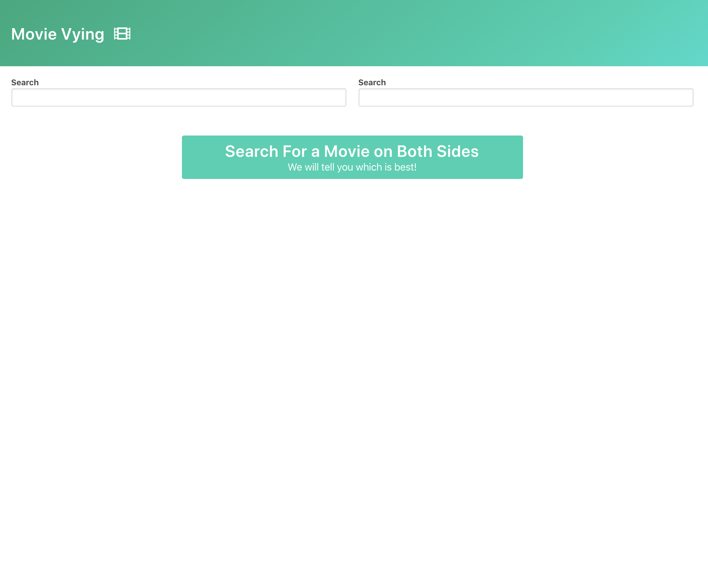
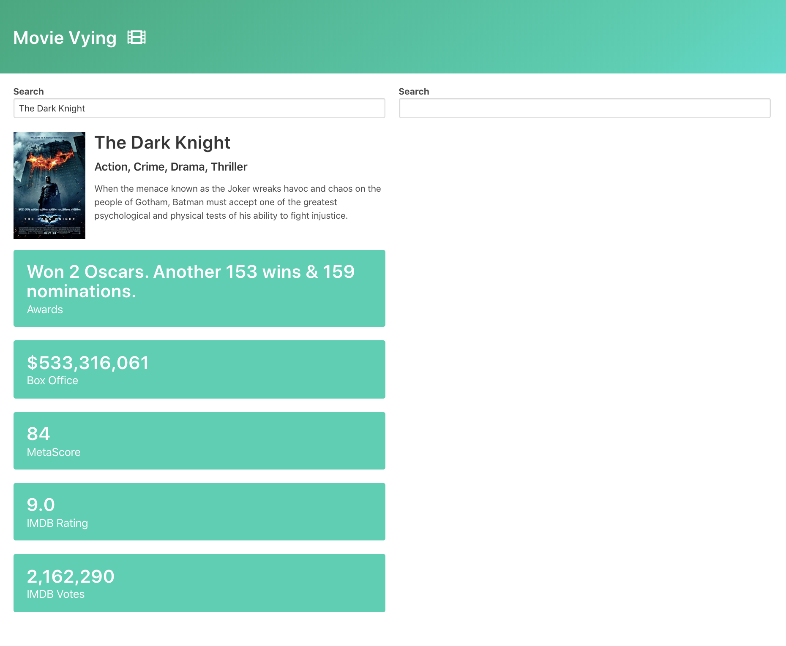
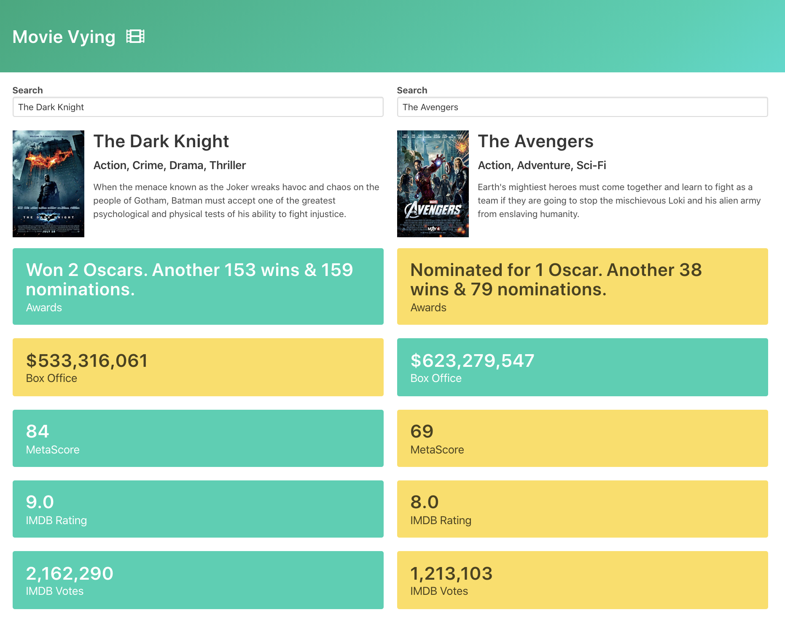

# moviesVying
Movie Vying

# Brief 
I'm going to be making an application called Movie Vying.
The idea here is that a user is going to search for a movie on the left hand side of the screen and
a different one on the right hand side of the screen, so user is going to type in some movie title in both sides and
then once they search for it we're going to fetch some information about that movie and show information
about them.

# Challenges
- Fetch data about movies, for that I will use API from omdbapi.com to fitch free 
- Build autocomplete widget from scratch
- Styling: I need to save time to move for functionalities, so I will use `Bulma CSS`  framework.
- #Challenge: To render the second side of Vying, I need to duplicating my code in very BAD way, and the challenge here is to make my code REUSABLE. So I refactored all the codes by made a general config function and take advantages of ES6 features.

# Here is the Movie Vying

# You can see it on Youtube:
  https://www.youtube.com/watch?v=q7WgY0ASxg0
# For More See My YouTube Channel: 
  https://www.youtube.com/channel/UCmF8WA70Lpjq7E2GEnyH5_g?view_as=subscriber

# Contact: 
  LinkedIn: https://www.linkedin.com/in/mansour-al-moukdad-b968a1107/
  Twitter: https://twitter.com/mansour_moukdad
